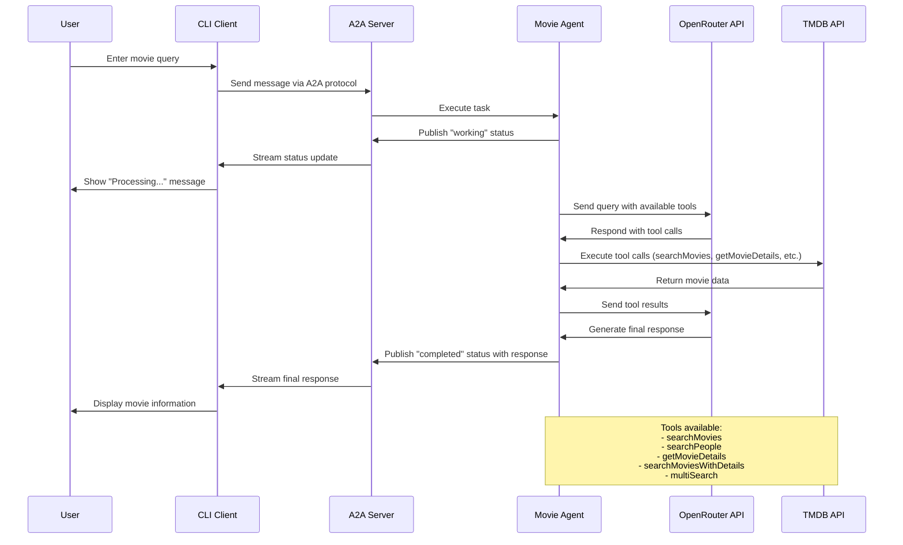

# A2A JS Sample: Movie Agent

## Source Code
[A2A JS Sample: Movie Agent](https://github.com/sing1ee/a2a-js-movie-agent)

## Project Overview

This project demonstrates a comprehensive movie information agent built with the A2A (Agent-to-Agent) framework. The agent leverages the TMDB (The Movie Database) API to provide detailed movie information, search functionality, and AI-powered conversational capabilities through OpenRouter integration.

## Key Features

- **Enhanced TMDB API Integration**: Modern implementation using Bearer token authentication
- **Comprehensive Movie Search**: Search movies with filters like year, adult content, etc.
- **Multi-Search Capabilities**: Search across movies, TV shows, and people simultaneously
- **AI-Powered Conversations**: Utilizes OpenRouter API for intelligent movie queries
- **Proxy Support**: Built-in SOCKS5/HTTP proxy support for network requests
- **A2A Framework**: Implements the Agent-to-Agent communication protocol
- **CLI Interface**: Interactive command-line interface for testing
- **Express Server**: RESTful API endpoints for agent communication

## Project Architecture

The project follows a modular architecture with clear separation of concerns:

```
src/
├── index.ts                    # Main server entry point
├── cli.ts                      # Command-line interface
├── config/
│   └── env.ts                  # Environment configuration
└── movie-agent/
    ├── index.ts                # Core agent executor
    ├── tools.ts                # TMDB API tools
    ├── tmdb.ts                 # TMDB API client
    └── openai.ts              # OpenRouter integration
```

## Step-by-Step Setup and Running

### 1. Prerequisites

- Node.js (v18 or higher)
- Bun package manager
- TMDB API account
- OpenRouter API account

### 2. Install Dependencies

```bash
# Clone the repository
git clone https://github.com/sing1ee/a2a-js-movie-agent.git
cd a2a-js-movie-agent

# Install dependencies using Bun
bun install
```

### 3. Environment Configuration

Create a `.env` file in the project root:

```env
# TMDB API Key (Bearer token)
TMDB_API_TOKEN=your_tmdb_api_token_here

# OpenRouter API Key for AI features
OPENROUTER_API_KEY=your_openrouter_api_key_here

# Proxy Configuration (Optional)
USE_PROXY=true
PROXY_URL=socks5://127.0.0.1:7890

# Server Configuration
NODE_ENV=development
PORT=3000
```

### 4. Running the Agent Server

```bash
# Start the development server
bun dev

# Or build and run in production
bun run build
bun start
```

The server will start on `http://localhost:3000` (or the port specified in your `.env` file).

### 5. Testing with CLI Interface

```bash
# Run the interactive CLI
bun cli

# Or specify a custom server URL
bun cli http://localhost:3000
```

### 6. Accessing Agent Information

Once the server is running, you can access:
- Agent Card: `http://localhost:3000/.well-known/agent.json`
- API Documentation: Available through the A2A framework endpoints

## Project Logic Explanation

### Core Components

1. **MovieAgentExecutor**: The main agent logic that processes user queries
2. **TMDB Tools**: Five specialized tools for movie data retrieval
3. **OpenAI Integration**: Handles AI-powered conversations via OpenRouter
4. **A2A Framework**: Manages agent communication protocol

### Available Tools

The agent provides five main tools for movie information:

1. **searchMovies**: Basic movie search with optional filters (year, adult content)
2. **searchPeople**: Search for actors, directors, and other film industry personalities
3. **getMovieDetails**: Retrieve detailed information about a specific movie
4. **searchMoviesWithDetails**: Combined search and details in one call (recommended)
5. **multiSearch**: Search across all content types (movies, TV shows, people) simultaneously

### Workflow Process

The agent follows this general workflow:

1. **Request Processing**: Receives user queries through the A2A framework
2. **Context Management**: Maintains conversation history and context
3. **AI Analysis**: Uses OpenRouter to understand user intent
4. **Tool Execution**: Calls appropriate TMDB tools based on the query
5. **Response Generation**: Formats and returns comprehensive movie information
6. **State Management**: Tracks task status and provides real-time updates

## Mermaid Sequence Diagram



## Technical Highlights

### AI-Powered Intelligence
The agent uses OpenRouter to provide intelligent responses, automatically determining which tools to use based on user queries. It can handle complex requests like "Find action movies from 2023 starring Tom Cruise" by combining multiple tool calls.

### Enhanced TMDB Integration
Unlike basic TMDB implementations, this agent:
- Uses modern Bearer token authentication
- Implements "append to response" for efficient API usage
- Automatically generates full image URLs
- Provides comprehensive error handling

### A2A Protocol Compliance
The agent fully implements the A2A (Agent-to-Agent) protocol, enabling:
- Standardized agent discovery through agent cards
- Real-time status updates during processing
- Proper task lifecycle management
- Streaming responses for better user experience

### Proxy Support
Built-in proxy support ensures the agent can work in restricted network environments, supporting:
- SOCKS5 proxies
- HTTP/HTTPS proxies
- Configurable proxy settings

## Usage Examples

### Basic Movie Search
```
User: "Tell me about the movie Inception"
Agent: [Searches for Inception, retrieves details, cast, and plot]
```

### Complex Queries
```
User: "Find sci-fi movies from 2020 directed by Christopher Nolan"
Agent: [Uses multiple tools to search and filter results]
```

### Actor Information
```
User: "What movies has Leonardo DiCaprio been in recently?"
Agent: [Searches for the actor and lists recent filmography]
```

## Development and Deployment

The project includes comprehensive development tools:

- **TypeScript**: Full type safety throughout the codebase
- **ESLint & Prettier**: Code quality and formatting
- **Bun**: Fast package management and execution
- **Modular Architecture**: Easy to extend and maintain

## Conclusion

This A2A JS Movie Agent demonstrates a sophisticated implementation of the Agent-to-Agent framework, combining modern web technologies with AI capabilities to create a powerful movie information system. The project serves as an excellent example of how to build intelligent, conversational agents that can interact with external APIs and provide rich, contextual responses to user queries.

The modular design, comprehensive error handling, and adherence to the A2A protocol make this project suitable for both learning purposes and production deployment scenarios. 